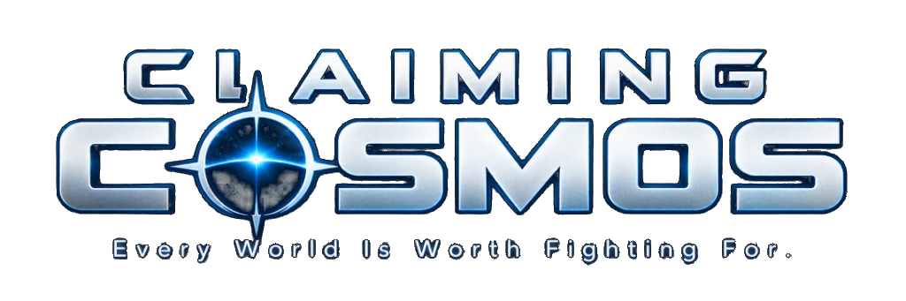

<p align="center">
  <picture>
    <source media="(prefers-color-scheme: dark)" srcset="resources/images/GameLogo.png">
    <source media="(prefers-color-scheme: light)" srcset="resources/images/GameLogo.png">
    
  </picture>
</p>

[Claiming Cosmos](https://claimingcosmos.com/) is a free browser space territorial strategy game. The **game code** is a fork of open-source [OpenFront.io](https://openfront.io/) under the AGPL. This project does **not** use OpenFront Inc.'s All-Rights-Reserved `/proprietary` branding (logos, favicon, premium CDN assets, or closed-source API).

This is a fork/rewrite of WarFront.io. Credit to https://github.com/WarFrontIO. OpenFront source is at https://github.com/openfrontio/OpenFrontIO.


[](https://www.gnu.org/licenses/agpl-3.0)
[](https://creativecommons.org/licenses/by-sa/4.0/)

## License

OpenFront **source code** is licensed under the **GNU Affero General Public License v3.0**. A public fork must keep that license, keep the copyright notice **© OpenFront and Contributors** visible, and must not present itself as official OpenFront.

Current copyright notices appear in:

- Footer: Claiming Cosmos © 2026 [Flying Vee Studios](https://flyingveestudios.netlify.app/); based on and independently modified from OpenFront; **© OpenFront and Contributors**; not affiliated with or endorsed by OpenFront Inc.; Source Code, AGPL v3 License, and Asset Credits links
- Loading screen: Claiming Cosmos; independent modified version of OpenFront; **© OpenFront and Contributors**; Modified by [Flying Vee Studios](https://flyingveestudios.netlify.app/), 2026; not affiliated notice

See the [LICENSE](LICENSE) for complete requirements.

For asset licensing, see [LICENSE-ASSETS](LICENSE-ASSETS).  
For license history, see [LICENSING.md](LICENSING.md).

**Do not copy or ship the `/proprietary` folder.** Those files are OpenFront Inc. trademarks/artwork, All Rights Reserved, and are not licensed for other games.

## 🌟 Features

- **Real-time Strategy Gameplay**: Expand your territory and engage in strategic battles
- **Alliance System**: Form alliances with other players for mutual defense
- **Multiple Maps**: Play across various geographical regions including Europe, Asia, Africa, and more
- **Resource Management**: Balance your expansion with defensive capabilities
- **Cross-platform**: Play in any modern web browser

## 📋 Prerequisites

- [npm](https://www.npmjs.com/) (v10.9.2 or higher)
- A modern web browser (Chrome, Firefox, Edge, etc.)

## 🚀 Installation

1. **Clone the repository**

   ```bash
   git clone https://github.com/DigitalGoliath2024/claiming-cosmos.git
   cd claiming-cosmos
   ```

2. **Install dependencies**

   ```bash
   npm run inst
   ```

   Do NOT use `npm install` nor `npm i` but instead use our `npm run inst`. It runs the safer `npm ci --ignore-scripts` to install dependencies exactly according to the versions in `package-lock.json` and doesn't run scripts. This can prevent being hit by a supply chain attack.

## 🎮 Running the Game

### Development Mode

Run both the client and server in development mode with live reloading:

```bash
npm run dev
```

This will:

- Start the webpack dev server for the client
- Launch the game server with development settings
- Open the game in your default browser (to disable this behavior, set `SKIP_BROWSER_OPEN=true` in your environment)

### Client Only

To run just the client with hot reloading:

```bash
npm run start:client
```

### Server Only

To run just the server with development settings:

```bash
npm run start:server-dev
```

### Connecting to staging or production backends

Sometimes it's useful to connect to production servers when replaying a game, testing user profiles, purchases, or login flow.

> To replay a production game, make sure you're on the same commit that the game you want to replay was executed on, you can find the `gitCommit` value via `https://api.openfront.io/game/[gameId]`.
> Unfinished games cannot be replayed on localhost.

To connect to staging api servers:

```bash
npm run dev:staging
```

To connect to production api servers:

```bash
npm run dev:prod
```

## 🛠️ Development Tools

- **Format code**:

  ```bash
  npm run format
  ```

- **Lint code with Oxlint and ESLint**:

  ```bash
  npm run lint
  ```

- **Lint and fix code with Oxlint and ESLint**:

  ```bash
  npm run lint:fix
  ```

- **Testing**
  ```bash
  npm test
  ```

## 🏗️ Project Structure

- `/src/client` - Frontend game client
- `/src/core` - Deterministic game simulation
- `/src/server` - Backend game server
- `/resources` - Static assets (images, maps, etc.)
- `/zbin` - Compact binary wire format for zod schemas (self-contained, zod-only)

## 🤝 Contributing

Contributions and translations are welcome! See [CONTRIBUTING.md](CONTRIBUTING.md) for the workflow, the approved-issue process, project governance, and translation info.
